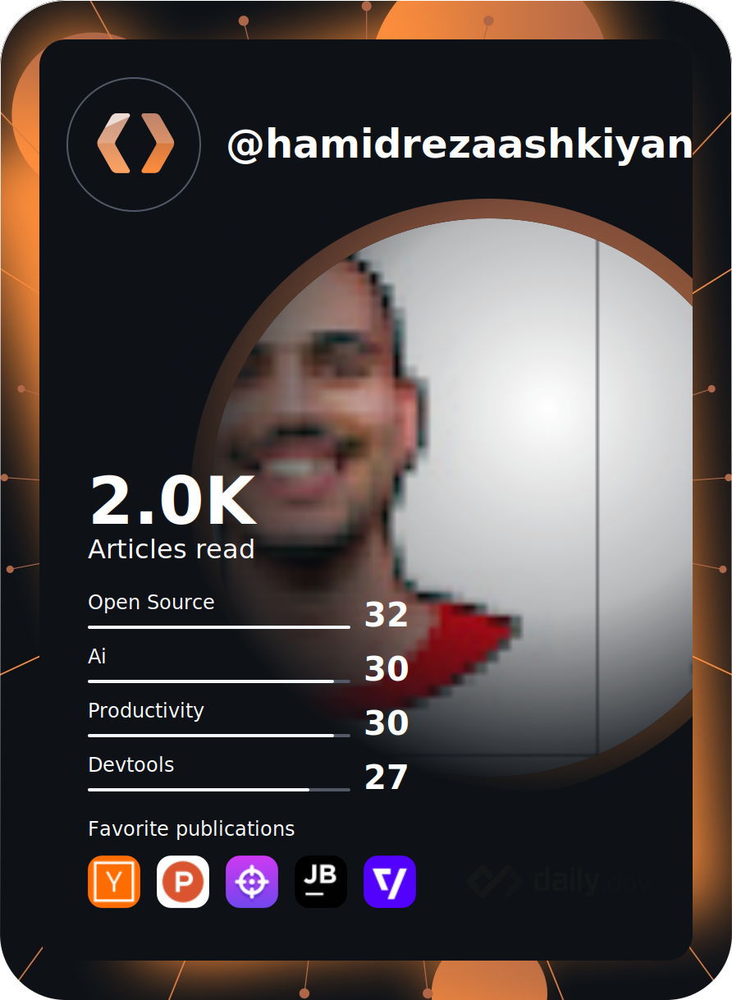

### Hi there 👋

  

  

## I am Hamid Reza Ashkiyan

- 🔭 I’m currently working on Linux!
- 🌱 I’m currently learning Linux!
- 👯 I’m looking to collaborate on OpenSource Projects!
- 🤔 I’m looking for help with Open Source Projects!
- 💬 Ask me about Developement or anything you like!
- 📫 How to reach me: @HamidRezaAshkiyan in Telegram!
- 😄 Pronouns: Hamid Reza Ashkiyan!
- ⚡ Fun fact: .Net 6 released!

