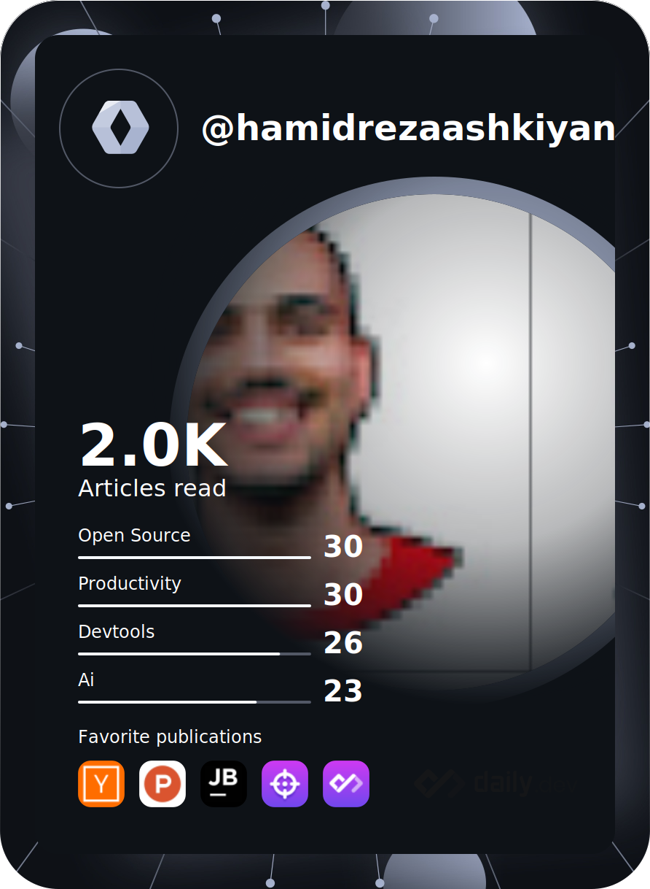

# Hi, I'm Hamid Reza Ashkiyan 👋

Backend developer focused on building reliable, scalable distributed systems with .NET.

  

  

  

## 👨‍💻 About Me

- 💼 Backend Developer specializing in **C#** and **ASP.NET Core**
- 🏗️ Interested in **Distributed Systems**, **Microservices**, and **Cloud-native applications**
- 🐳 Working with **Docker**, **RabbitMQ**, **SQL Server**, and **Redis**
- 🌍 Open to collaborating on **Open Source** projects
- 📚 Always learning and improving my engineering skills

## 🛠 Tech Stack

**Languages**
- C#
- SQL

**Backend**
- ASP.NET Core
- Entity Framework Core
- Minimal APIs
- REST APIs

**Architecture**
- DDD
- Clean Architecture
- Microservices

**Infrastructure**
- Docker
- RabbitMQ
- Redis
- SQL Server

## 📫 Connect with Me

- LinkedIn: https://www.linkedin.com/in/hamidrezaashkiyan
- Telegram: @HamidRezaAshkiyan

---

> *"Write code that's easy to change, not just easy to write."*
